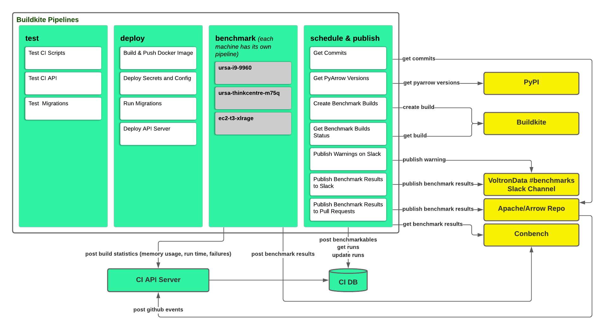

# arrow-benchmarks-ci


## How can I get Conbench credentials?
You might need Conbench credentials for these reasons:
- You need to add your own machine to the list of machines where Apache Arrow benchmarks are run for every apache/arrow
master commit and for benchmark requests on PRs
- You need to test benchmark builds (that run on `ursa-i9-9960x` and `ursa-thinkcentre-m75q`) locally to verify that your
code changes will not break benchmark builds

TODO: Add steps

#### How can I test benchmark builds that run on ursa-i9-9960x and ursa-thinkcentre-m75q locally
```bash
# Set conbench credentials
export CONBENCH_EMAIL=<conbench_user_id>
export CONBENCH_PASSWORD=<conbench_user_password>

# Build docker image with Arrow dependencies installed
cd ~/arrow-benchmarks-ci
docker build -f buildkite/benchmark-test/Dockerfile . -t benchmark-test

# Run benchmarks
docker run -i \
    --env CONBENCH_EMAIL=$CONBENCH_EMAIL \
    --env CONBENCH_PASSWORD="$CONBENCH_PASSWORD" \
    --env BENCHMARKABLE_TYPE=${BENCHMARKABLE_TYPE:-"arrow-commit"} \
    --env BENCHMARKABLE=${BENCHMARKABLE:-"641554b0bcce587549bfcfd0cde3cb4bc23054aa"} \
    --env PYTHON_VERSION=${PYTHON_VERSION:-"3.8"} \
    --env BENCHMARKS_DATA_DIR="/data" \
    --env FILTERS=${FILTERS} \
    --env RUN_ID=$BUILDKITE_BUILD_ID \
    --env RUN_NAME=${RUN_NAME:-"benchmark build test: $BUILDKITE_BUILD_ID"} \
    --env MACHINE="docker-container-for-testing-benchmark-builds" \
    --env CONBENCH_URL="https://conbench.ursa.dev" \
    benchmark-test bash buildkite/benchmark/utils.sh build_arrow_and_run_benchmark_groups
```

#### How can I test benchmark builds that run on ursa-i9-9960x and ursa-thinkcentre-m75q using Buildkite
This option is only available to [Apache Arrow CI Buildkite org](https://buildkite.com/organizations/apache-arrow/) users at the moment.

1. Go to https://buildkite.com/apache-arrow/arrow-bci-benchmark-build-test
2. Click New Build
    - Set Commit and Branch for arrow-benchmarks-ci repo that you would like to test
    - Click Create Build
