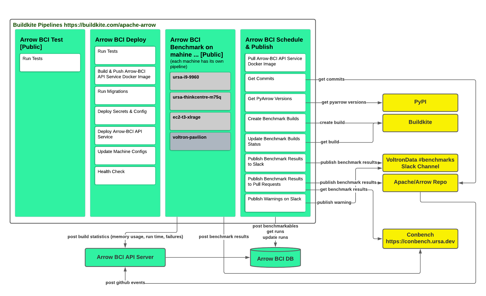

# arrow-benchmarks-ci


Arrow Benchmarks CI is responsible for 
- orchestrating and prioritizing benchmark builds for [Apache Arrow](https://github.com/apache/arrow) based on 
the [list of benchmarks](https://github.com/ursacomputing/benchmarks/blob/main/benchmarks.json) in [Benchmarks repo](https://github.com/ursacomputing/benchmarks)
- publishing benchmark results to [Apache Arrow](https://github.com/apache/arrow) pull requests associated with commits to master branch ([example](https://github.com/apache/arrow/pull/11843#issuecomment-986912639))
- posting benchmarks results to [Conbench](https://conbench.ursa.dev/)

Arrow Benchmarks CI consists of 
- [Buildkite pipelines](https://buildkite.com/apache-arrow) and scripts for running benchmarks on [benchmark machines](https://github.com/ursacomputing/arrow-benchmarks-ci/blob/main/config.py#L47)
- Arrow BCI API service responsible for 
    - listening to [apache/arrow](https://github.com/apache/arrow) Pull Request comment events 
    so benchmark builds can be scheduled for pull requests with an `@ursabot please benchmark` comment
    - persisting benchmark build statistics (e.g., memory usage, run time, errors, and conda packages)
 


#### Arrow Benchmarks CI Public Buildkite Pipelines
- [Arrow BCI Test](https://buildkite.com/apache-arrow/arrow-bci-test) is used for testing Arrow BCI API service and CI scripts
- [Arrow BCI Benchmark on ec2-t3-xlarge-us-east-2](https://buildkite.com/apache-arrow/arrow-bci-benchmark-on-ec2-t3-xlarge-us-east-2) is used for running `cloud` benchmarks
- [Arrow BCI Benchmark on ursa-i9-9960x](https://buildkite.com/apache-arrow/arrow-bci-benchmark-on-ursa-i9-9960x) is used for running Python, R and JavaScript benchmarks
- [Arrow BCI Benchmark on ursa-thinkcentre-m75q](https://buildkite.com/apache-arrow/arrow-bci-benchmark-on-ursa-thinkcentre-m75q) is used for running C++ and Java benchmarks
- [Arrow BCI Benchmark on voltron-pavilion](https://buildkite.com/apache-arrow/arrow-bci-benchmark-on-voltron-pavilion) is not used yet but will be running R TPCH benchmarks in a very near future

Note that you can view builds for these pipelines but you can not manually schedule new builds.

#### How can I add my own benchmark machine to Arrow Benchmarks CI

Benchmark machines should be bare metal machines dedicated to only running benchmarks to 
avoid high variability in benchmark results that can result in false regression/improvements.

Please use this doc to add a new benchmark machine: [How to Add New Benchmark Machine](docs/how-to-add-new-benchmark-machine.md)

#### How can I test benchmark builds that run on ursa-i9-9960x and ursa-thinkcentre-m75q locally
```bash
# Set env vars for conbench credentials if you need benchmark results to be posted to Conbench during testing
export CONBENCH_EMAIL=<conbench_user_id>
export CONBENCH_PASSWORD=<conbench_user_password>

# Build docker image with Arrow dependencies installed
cd ~/arrow-benchmarks-ci
docker build -f buildkite/benchmark-test/Dockerfile . -t benchmark-test

# Run benchmarks
docker run -i \
    --env BENCHMARKABLE=${BENCHMARKABLE:-"ac2d8ff481816299e2b047bf8a4546baccc3d050"} \
    --env BENCHMARKABLE_TYPE=${BENCHMARKABLE_TYPE:-"arrow-commit"} \
    --env BENCHMARKS_DATA_DIR="/data" \
    --env CONBENCH_EMAIL=$CONBENCH_EMAIL \
    --env CONBENCH_PASSWORD="$CONBENCH_PASSWORD" \
    --env CONBENCH_URL="https://conbench.ursa.dev" \
    --env MACHINE="docker-container-for-testing-benchmark-builds" \
    --env PYTHON_VERSION=${PYTHON_VERSION:-"3.8"} \
    --env RUN_ID=$BUILDKITE_BUILD_ID \
    --env RUN_NAME=${RUN_NAME:-"benchmark build test: $BUILDKITE_BUILD_ID"} \
    benchmark-test bash buildkite/benchmark/utils.sh create_conda_env_and_run_benchmarks
```

#### How can I test benchmark builds that run on ursa-i9-9960x and ursa-thinkcentre-m75q using Buildkite
This option is only available to [Apache Arrow CI Buildkite org](https://buildkite.com/apache-arrow/) users at the moment.

1. Go to https://buildkite.com/apache-arrow/arrow-bci-benchmark-build-test
2. Click New Build
    - Set Commit and Branch for arrow-benchmarks-ci repo that you would like to test
    - Click Create Build
